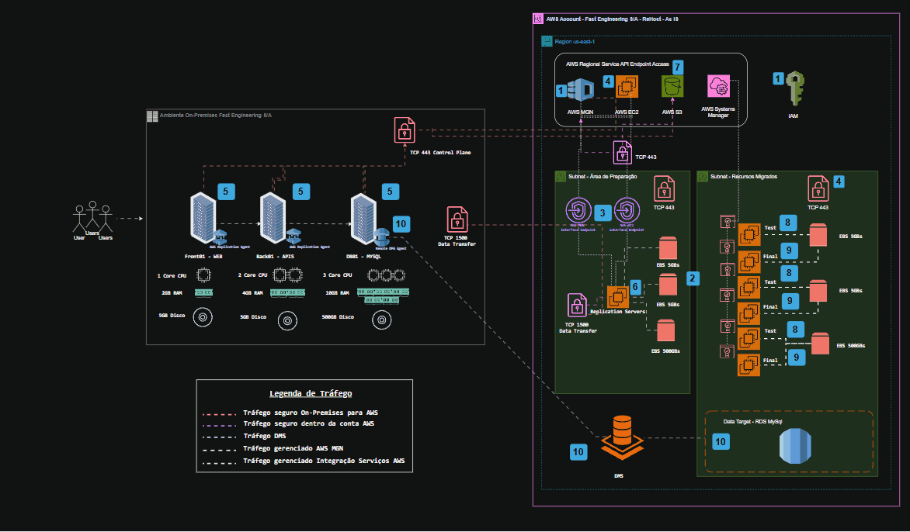
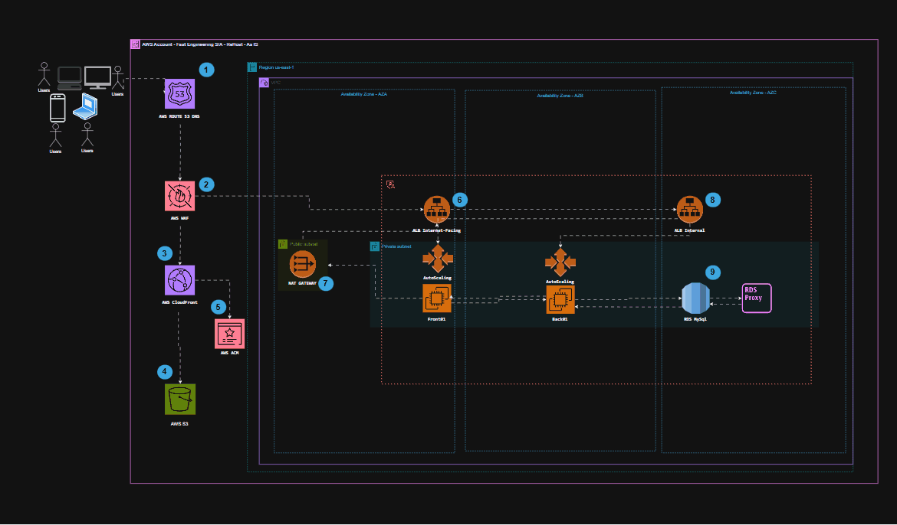

# Projeto Final  #PB - NOV 2024 | DevSecOps

  

### 👥 Integrantes do Grupo:
- Hick Tan
- Guilherme de Brito Ferreira

## 🔎 CASE:

"Nós somos da empresa "Fast Engineering S/A" e gostaríamos de uma solução dos senhores(as), que fazem parte da empresa terceira "TI SOLUÇÕES INCRÍVEIS". Nosso eCommerce está crescendo e a solução atual não está atendendo mais a alta demanda de acessos e compras que estamos tendo. Desde o início do ano os acessos e compras estão crescendo 20% a cada mês.

Atualmente usamos:
* 01 servidor para Banco de Dados Mysql;
* 01 servidor para a aplicação utilizando REACT;
* 01 servidor de web Server e que armazena estáticos como fotos e links.

### Diagrama da situalção atual

Nosso pedido é um ORÇAMENTO com:

- ESCOPO;
- ARQUITETURA DA NOVA SOLUÇÃO;
- VALORES;
- PRAZO DE ENTREGA;
- CRONOGRAMA MACRO DE ENTREGAS.

Sobre a construção da arquitetura para o futuro website da nossa empresa, precisamos seguir as melhores práticas DevOps." 

O que é requerido na atividade:

+ Ambiente Kubernetes;
+ Banco de dados PaaS;
+ MultiAZ;
+ Segurança de backup de dados;
+ Persistência dos dados;
+ Balanceamento de carga com healthcheck;
+ Segurança (liberar somente o necessário/mínimo acesso possível).

### Objetivo: Monte a proposta e a arquitetura do que o grupo propõe entregar._

A proposta é realizar a migração de seu ambiente para a AWS, separado em duas etapas:

1. Migração para AWS (Lift-and-Shift).
2. Modernização para AWS (EKS e Serviços Gerenciados).
3. Com base nos requisitos do Projeto a disciplina de FinOps está em uso, Virgínia US-EAST-1 foi selecionada não observando compliance ou leis e sim eficiência de custos.
4. Especificidades e configurações extras dos serviços não foram utilizadas.

## Etapa 1. Migração para AWS (Lift-and-Shift)

### Atividades Necessárias para a Migração
1. Avaliação da infraestrutura atual e mapeamento dos recursos.
2. Migração dos servidores para instâncias EC2 na AWS utilizando AWS MGN e DMS.
3. Configuração de segurança básica (Security Groups, IAM).
4. Criação das VPCs, subnets e grupos de segurança necessários.
5. Implementação de backups automáticos usando Amazon S3.
6. Testes e validação dos servidores e banco de dados migrados.
7. Descomissionamento do ambiente antigo após a validação.

### Ferramentas Utilizadas
- **AWS MGN (Application Migration Service)** - Para migrar servidores do ambiente on-premises para EC2.
- **AWS DMS (Database Migration Service)** - Para migrar e replicar o banco de dados MySQL para RDS.
- **Amazon EC2** - Para hospedar as instâncias do frontend e backend.
- **Amazon RDS** - Para banco de dados gerenciado com alta disponibilidade.
- **Amazon S3** - Para armazenamento de arquivos estáticos.
- **AWS IAM, Security Groups e Network ACLs** - Para controle de segurança e acesso.
- **AWS Cost Calculator** - Para estimativa de custos.

### Diagrama da Infraestrutura na AWS (Lift-and-Shift)

  
   
<em>Visão Macro Migration</em>

  
   
<em>Visão Macro Migration Zoom</em>

  
   
<em>Arquitetura nova</em>

  
   
<em>Arquitetura nova Zoom</em>

A nova solução de arquitetura também possui alinhamento com os pilares da AWS Well-Architected Framework:
  + Excelência Operacional 
  + Segurança 
  + Confiabilidade 
  + Eficiência de Performance 
  + Otimização de Custos 
  + Sustentabilidade 

#### Descrição do Diagrama
O ambiente consiste em uma VPC com múltiplas subnets e zonas de disponibilidade (AZs):
1. **Fase de Preparação (On-Premises para AWS):**
   - O **AWS Replication Agent** é instalado nos servidores on-premises, permitindo a captura contínua das mudanças dos discos e enviando para a AWS.
   - O **AWS MGN** recebe essas replicações e mantém um estado atualizado na AWS para garantir uma migração rápida e sem downtime significativo.
   - Uma vez que os servidores EC2 na AWS estão sincronizados, o tráfego pode ser redirecionado e os servidores antigos podem ser desativados.

2. **Migração do Banco de Dados:**
   - O **AWS DMS** é utilizado para migrar o banco de dados MySQL on-premises para o **Amazon RDS**, garantindo replicação contínua até a virada de chave.
   - A replicação permite testes antes da migração definitiva, minimizando riscos de perda de dados.

3. **Infraestrutura AWS Pós-Migração:**
   - Instâncias **EC2** para frontend e backend, cada uma conectada a volumes **EBS**.
   - Um banco de dados **Amazon RDS** configurado em **Multi-AZ** para garantir disponibilidade.
   - Um **Application Load Balancer (ALB)** para balanceamento de carga entre as instâncias EC2.
   - **NAT Gateway** para permitir comunicação segura entre servidores privados e serviços externos.
   - **Route 53** e **CloudFront** para distribuição e roteamento de tráfego global.
   - **WAF** para proteção contra ataques na camada de aplicação.

### Segurança
- **Separação de rede com VPC, subnets privadas e públicas.**
- **Uso de Security Groups e Network ACLs** para controle de tráfego entre instâncias.
- **Monitoramento com AWS GuardDuty e AWS CloudTrail.**
- **Proteção contra ataques DDoS com AWS WAF e AWS Shield.**
- **Uso de IAM para controle de permissões e autenticação.**

### Backup
- **Amazon S3** para armazenar snapshots e backups.
- **Snapshots de EBS e RDS** para recuperação rápida em caso de falha.

### Custo da Infraestrutura na AWS
Cálculo dos custos estimados em doláres dos serviços na AWS utilizando o **Pricing Calculator.**

  
   
<em>Estimativa de Custos Totais</em>

### Premissas e Detalhamento dos custos

## 1. Valores estimados que podem sofrer alterações como alteração no projeto, novas configurações e câmbio.
## 2. Não será utilizado o total mensurado na calculadora no total de 1 mês.
## 3. Não foi utilizado descontos ou incentivos fiscais.

 

  
   
<em>Detalhamento de Custos 1</em>

 

  
   
<em>Detalhamento de Custos 2</em>

 

  
   
<em>Detalhamento de Custos 3</em>

##  Detalhamento dos Custos para 3 Dias

---

#### 1. AWS Database Migration Service
- **Custo mensal**: 507,91 USD  
- **Custo para 3 dias**:  
  `(507,91 / 30) * 3 = 50,79 USD`

---

#### 2. AWS Application Migration Service
- **Custo mensal**: 0,00 USD  
- **Custo para 3 dias**: 0,00 USD  

---

#### 3. Amazon RDS for MySQL (24% Utilizado/Mês)
- **Custo mensal**: 484,24 USD  
- **Custo para 3 dias**:  
  `(484,24 / 30) * 3 = 48,42 USD`

---

#### 4. Amazon RDS for MySQL (100% Utilizado/Mês)
- **Custo mensal**: 954,98 USD  
- **Custo para 3 dias**:  
  `(954,98 / 30) * 3 = 95,50 USD`

---

#### 5. Amazon EC2 (Compute Savings Plans 3yr All Upfront)
- **Custo mensal**: 14,00 USD  
- **Custo para 3 dias**:  
  `(14,00 / 30) * 3 = 1,40 USD`

---

#### 6. Amazon EC2 (EC2 Instance Savings Plans 3yr All Upfront)
- **Custo mensal**: 0,50 USD  
- **Custo para 3 dias**:  
  `(0,50 / 30) * 3 = 0,05 USD`

---

#### 7. Amazon Simple Storage Service (S3)
- **Custo mensal**: 47,37 USD  
- **Custo para 3 dias**:  
  `(47,37 / 30) * 3 = 4,74 USD`

---

#### 8. Amazon Virtual Private Cloud (VPC)
- **Custo mensal**: 10,95 USD  
- **Custo para 3 dias**:  
  `(10,95 / 30) * 3 = 1,10 USD`

---

#### 9. AWS Systems Manager
- **Custo mensal**: 0,00 USD  
- **Custo para 3 dias**: 0,00 USD  

---

#### 10. AWS Private Certificate Authority
- **Custo mensal**: 150,00 USD  
- **Custo para 3 dias**:  
  `(150,00 / 30) * 3 = 15,00 USD`

---

### Resumo dos Custos para 3 Dias

| **Serviço**                              | **Custo para 3 Dias (USD)** |
|------------------------------------------|-----------------------------|
| AWS Database Migration Service           | 50,79                       |
| AWS Application Migration Service        | 0,00                        |
| Amazon RDS for MySQL (24% Utilizado)     | 48,42                       |
| Amazon RDS for MySQL (100% Utilizado)    | 95,50                       |
| Amazon EC2 (Compute Savings Plans)       | 1,40                        |
| Amazon EC2 (EC2 Instance Savings Plans)  | 0,05                        |
| Amazon S3                                | 4,74                        |
| Amazon VPC                               | 1,10                        |
| AWS Systems Manager                      | 0,00                        |
| AWS Private Certificate Authority        | 15,00                       |
| **Total**                                | **217,00 USD**              |

---

 
 

  
   
<em>Conversão em Reais</em>

### Observações
1. Os custos de **upfront** (pagamento antecipado) não foram incluídos no cálculo, pois são valores fixos pagos uma única vez e não dependem do período de utilização.
2. O custo total estimado para **3 dias** usando as premissas estabelecidas é de **217,00 USD**.

 
 

  
   
<em>Estimativa valor total da infraestrutura Migrada AS IS</em>

 

| **Descrição**            | **Custo (USD)**   |
|--------------------------|------------------|
| 💰 **Custo Inicial (Upfront Cost)** | **0.00**       |
| 📆 **Custo Mensal (Monthly Cost)**  | **1,353.57**   |
| 🏦 **Custo Anual (Total 12 meses)**  | **16,242.84**  |

##  Detalhamento dos Custos da Infraestrutura Migrada - Período de 1 mês

---

## Etapa 2. Modernização para AWS (EKS e Serviços Gerenciados)

### Atividades Necessárias para a Modernização
1. Configuração da infraestrutura como código com Terraform e CloudFormation.
2. Criação do cluster Kubernetes no Amazon EKS.
3. Configuração do CI/CD usando GitHub, CodePipeline, CodeBuild e ECR.
4. Implantação do backend e frontend como microservices em pods do EKS.
5. Configuração do autoescalonamento de pods e nodes (HPA e ASG).
6. Configuração de armazenamento persistente para banco de dados e objetos estáticos.
7. Implementação de monitoramento, segurança e backup.

### Ferramentas Utilizadas
- **Amazon EKS (Elastic Kubernetes Service)** - Para orquestração de containers.
- **Amazon RDS (Multi-AZ)** - Para banco de dados gerenciado.
- **Amazon S3** - Para armazenamento de imagens e objetos estáticos.
- **AWS CodePipeline + CodeBuild + ECR** - Para pipeline de CI/CD.
- **AWS Auto Scaling** - Para escalar aplicações automaticamente.
- **AWS IAM e Secrets Manager** - Para gerenciamento de credenciais e permissões.
- **AWS CloudWatch e GuardDuty** - Para monitoramento e segurança.

### Diagrama da Infraestrutura na AWS (Modernização com EKS)

#### Descrição do Diagrama
A nova infraestrutura será baseada em Kubernetes no EKS e conterá:
- **CI/CD:** O fluxo de desenvolvimento ocorre no GitHub, seguido pelo Terraform para provisionamento e CodePipeline para automação da entrega contínua. CodeBuild compila as imagens e armazena no ECR.
- **Cluster EKS:** Distribuído em três AZs, dividido entre ambiente de produção e teste.
  - **Produção:** Roda em instâncias EC2 com node groups e autoescalonamento (HPA e ASG).
  - **Testes:** Roda no AWS Fargate para menor custo e escalabilidade sob demanda.
  - **Ingress Controller** gerencia a entrada de tráfego e encaminha para os serviços apropriados.
- **Banco de Dados:** Amazon RDS em Multi-AZ para alta disponibilidade.
- **Networking:** NAT Gateway para permitir acesso seguro a serviços externos.
- **Segurança:** WAF, GuardDuty, Secrets Manager e políticas de acesso rigorosas.

### Segurança
- **Network Policies no Kubernetes** para controlar tráfego entre pods.
- **IAM e Secrets Manager** para credenciais seguras.
- **Monitoramento com CloudWatch e GuardDuty.**
- **WAF e Shield** para proteção contra ataques externos.

### Backup
- **Amazon S3** para armazenar backups automatizados.
- **AWS Backup e snapshots do RDS** para recuperação em desastres.

### Custo da Infraestrutura na AWS
Cálculo dos custos estimados dos serviços na AWS utilizando o **Pricing Calculator.**

Estimativa de custo da infraestrutura. [Estimativa Migrada](/Estimativa Modernização.pdf)

---

## 3. Conclusão
A migração inicial foi realizada via lift-and-shift, garantindo uma transição rápida e segura para a AWS. Posteriormente, a modernização foi implementada utilizando serviços gerenciados como EKS, RDS, CodePipeline e Fargate, garantindo escalabilidade, segurança e eficiência operacional. A nova infraestrutura reduz a complexidade do gerenciamento, melhora a resiliência e otimiza custos a longo prazo. Caso haja necessidade de ajustes ou novas implementações, a arquitetura permite flexibilidade para futuras evoluções.

## Licença
Este projeto está licenciado sob a [MIT License](LICENSE).

## Créditos
Projeto desenvolvido como parte do Projeto Final para #PB - NOV 2024 | DevSecOps.

