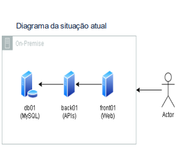
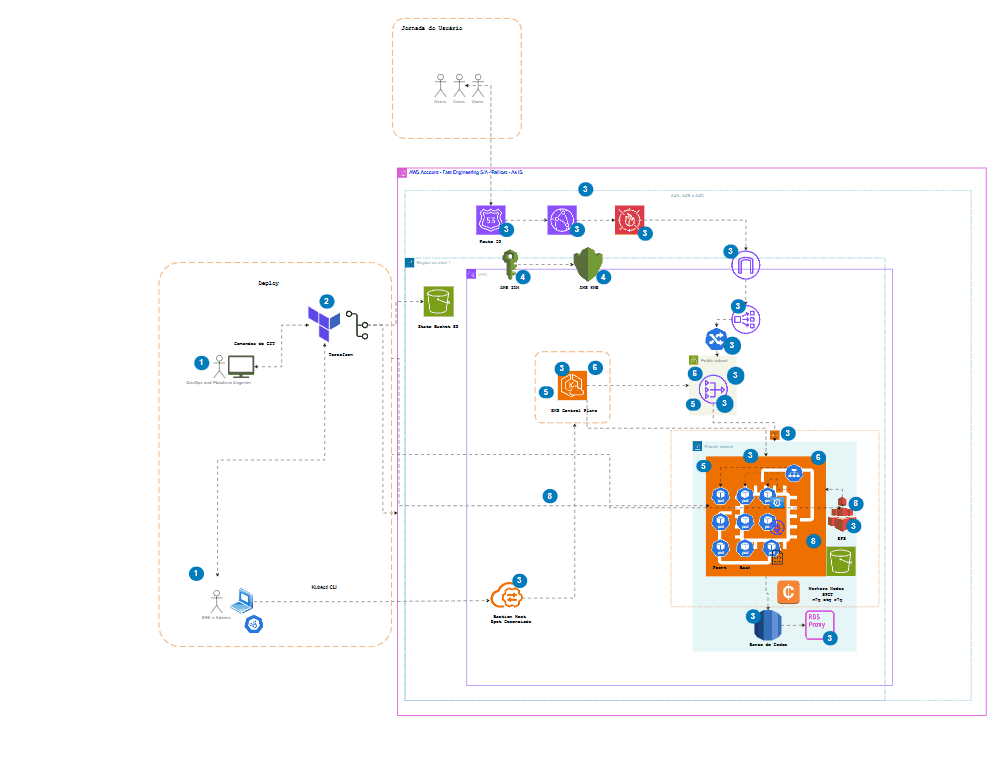
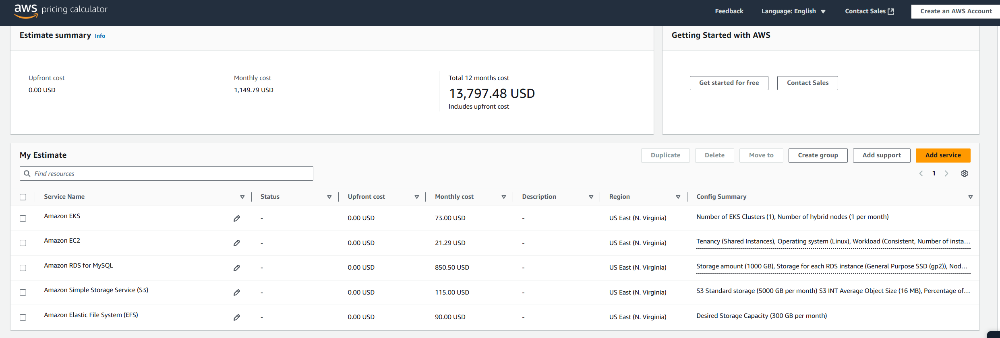

# Projeto Final  #PB - NOV 2024 | DevSecOps

  

### 👥 Integrantes do Grupo:
- Hick Tan
- Guilherme de Brito Ferreira

## 🔎 CASE:

"Nós somos da empresa "Fast Engineering S/A" e gostaríamos de uma solução dos senhores(as), que fazem parte da empresa terceira "TI SOLUÇÕES INCRÍVEIS". Nosso eCommerce está crescendo e a solução atual não está atendendo mais a alta demanda de acessos e compras que estamos tendo. Desde o início do ano os acessos e compras estão crescendo 20% a cada mês.

Atualmente usamos:
* 01 servidor para Banco de Dados Mysql;
* 01 servidor para a aplicação utilizando REACT;
* 01 servidor de web Server e que armazena estáticos como fotos e links.

### Diagrama da situalção atual

  
   
<em>Diagrama Atual</em>

Nosso pedido é um ORÇAMENTO com:

- ESCOPO;
- ARQUITETURA DA NOVA SOLUÇÃO;
- VALORES;
- PRAZO DE ENTREGA;
- CRONOGRAMA MACRO DE ENTREGAS.

Sobre a construção da arquitetura para o futuro website da nossa empresa, precisamos seguir as melhores práticas DevOps." 

O que é requerido na atividade:

+ Ambiente Kubernetes;
+ Banco de dados PaaS;
+ MultiAZ;
+ Segurança de backup de dados;
+ Persistência dos dados;
+ Balanceamento de carga com healthcheck;
+ Segurança (liberar somente o necessário/mínimo acesso possível).

### Objetivo: Monte a proposta e a arquitetura do que o grupo propõe entregar._

A proposta é realizar a migração de seu ambiente para a AWS, separado em duas etapas:

1. Migração para AWS (Lift-and-Shift).
2. Modernização para AWS (EKS e Serviços Gerenciados).
3. Com base nos requisitos do Projeto a disciplina de FinOps está em uso, Virgínia US-EAST-1 foi selecionada não observando compliance ou leis e sim eficiência de custos.
4. Especificidades e configurações extras dos serviços não foram utilizadas.

## Etapa 1. Migração para AWS (Lift-and-Shift)

### Atividades Necessárias para a Migração
1. Avaliação da infraestrutura atual e mapeamento dos recursos.
2. Migração dos servidores para instâncias EC2 na AWS utilizando AWS MGN e DMS.
3. Configuração de segurança básica (Security Groups, IAM).
4. Criação das VPCs, subnets e grupos de segurança necessários.
5. Implementação de backups automáticos usando Amazon S3.
6. Testes e validação dos servidores e banco de dados migrados.
7. Descomissionamento do ambiente antigo após a validação.

### Ferramentas Utilizadas
- **AWS MGN (Application Migration Service)** - Para migrar servidores do ambiente on-premises para EC2.
- **AWS DMS (Database Migration Service)** - Para migrar e replicar o banco de dados MySQL para RDS.
- **Amazon EC2** - Para hospedar as instâncias do frontend e backend.
- **Amazon RDS** - Para banco de dados gerenciado com alta disponibilidade.
- **Amazon S3** - Para armazenamento de arquivos estáticos.
- **AWS IAM, Security Groups e Network ACLs** - Para controle de segurança e acesso.
- **AWS Cost Calculator** - Para estimativa de custos.

### Diagrama da Infraestrutura na AWS (Lift-and-Shift)

  
   
<em>Visão Macro Migration</em>

  
   
<em>Visão Macro Migration Zoom</em>

  
   
<em>Arquitetura nova</em>

  
   
<em>Arquitetura nova Zoom</em>

A nova solução de arquitetura também possui alinhamento com os pilares da AWS Well-Architected Framework:
  + Excelência Operacional 
  + Segurança 
  + Confiabilidade 
  + Eficiência de Performance 
  + Otimização de Custos 
  + Sustentabilidade 

#### Descrição do Diagrama
O ambiente consiste em uma VPC com múltiplas subnets e zonas de disponibilidade (AZs):
1. **Fase de Preparação (On-Premises para AWS):**
   - O **AWS Replication Agent** é instalado nos servidores on-premises, permitindo a captura contínua das mudanças dos discos e enviando para a AWS.
   - O **AWS MGN** recebe essas replicações e mantém um estado atualizado na AWS para garantir uma migração rápida e sem downtime significativo.
   - Uma vez que os servidores EC2 na AWS estão sincronizados, o tráfego pode ser redirecionado e os servidores antigos podem ser desativados.

2. **Migração do Banco de Dados:**
   - O **AWS DMS** é utilizado para migrar o banco de dados MySQL on-premises para o **Amazon RDS**, garantindo replicação contínua até a virada de chave.
   - A replicação permite testes antes da migração definitiva, minimizando riscos de perda de dados.

3. **Infraestrutura AWS Pós-Migração:**
   - Instâncias **EC2** para frontend e backend, cada uma conectada a volumes **EBS**.
   - Um banco de dados **Amazon RDS** configurado em **Multi-AZ** para garantir disponibilidade.
   - Um **Application Load Balancer (ALB)** para balanceamento de carga entre as instâncias EC2.
   - **NAT Gateway** para permitir comunicação segura entre servidores privados e serviços externos.
   - **Route 53** e **CloudFront** para distribuição e roteamento de tráfego global.
   - **WAF** para proteção contra ataques na camada de aplicação.

### Segurança
- **Separação de rede com VPC, subnets privadas e públicas.**
- **Uso de Security Groups e Network ACLs** para controle de tráfego entre instâncias.
- **Monitoramento com AWS GuardDuty e AWS CloudTrail.**
- **Proteção contra ataques DDoS com AWS WAF e AWS Shield.**
- **Uso de IAM para controle de permissões e autenticação.**

### Backup
- **Amazon S3** para armazenar snapshots e backups.
- **Snapshots de EBS e RDS** para recuperação rápida em caso de falha.

### Custo da Infraestrutura na AWS
Cálculo dos custos estimados em doláres dos serviços na AWS utilizando o **Pricing Calculator.**

  
   
<em>Estimativa de Custos Totais</em>

### Premissas e Detalhamento dos custos

## 1. Valores estimados que podem sofrer alterações como alteração no projeto, novas configurações e câmbio.
## 2. Não será utilizado o total mensurado na calculadora no total de 1 mês.
## 3. Não foi utilizado descontos ou incentivos fiscais.

 

  
   
<em>Detalhamento de Custos 1</em>

 

  
   
<em>Detalhamento de Custos 2</em>

 

  
   
<em>Detalhamento de Custos 3</em>

##  Detalhamento dos Custos para 3 Dias

---

#### 1. AWS Database Migration Service
- **Custo mensal**: 507,91 USD  
- **Custo para 3 dias**:  
  `(507,91 / 30) * 3 = 50,79 USD`

---

#### 2. AWS Application Migration Service
- **Custo mensal**: 0,00 USD  
- **Custo para 3 dias**: 0,00 USD  

---

#### 3. Amazon RDS for MySQL (24% Utilizado/Mês)
- **Custo mensal**: 484,24 USD  
- **Custo para 3 dias**:  
  `(484,24 / 30) * 3 = 48,42 USD`

---

#### 4. Amazon RDS for MySQL (100% Utilizado/Mês)
- **Custo mensal**: 954,98 USD  
- **Custo para 3 dias**:  
  `(954,98 / 30) * 3 = 95,50 USD`

---

#### 5. Amazon EC2 (Compute Savings Plans 3yr All Upfront)
- **Custo mensal**: 14,00 USD  
- **Custo para 3 dias**:  
  `(14,00 / 30) * 3 = 1,40 USD`

---

#### 6. Amazon EC2 (EC2 Instance Savings Plans 3yr All Upfront)
- **Custo mensal**: 0,50 USD  
- **Custo para 3 dias**:  
  `(0,50 / 30) * 3 = 0,05 USD`

---

#### 7. Amazon Simple Storage Service (S3)
- **Custo mensal**: 47,37 USD  
- **Custo para 3 dias**:  
  `(47,37 / 30) * 3 = 4,74 USD`

---

#### 8. Amazon Virtual Private Cloud (VPC)
- **Custo mensal**: 10,95 USD  
- **Custo para 3 dias**:  
  `(10,95 / 30) * 3 = 1,10 USD`

---

#### 9. AWS Systems Manager
- **Custo mensal**: 0,00 USD  
- **Custo para 3 dias**: 0,00 USD  

---

#### 10. AWS Private Certificate Authority
- **Custo mensal**: 150,00 USD  
- **Custo para 3 dias**:  
  `(150,00 / 30) * 3 = 15,00 USD`

---

### Resumo dos Custos para 3 Dias

| **Serviço**                              | **Custo para 3 Dias (USD)** |
|------------------------------------------|-----------------------------|
| AWS Database Migration Service           | 50,79                       |
| AWS Application Migration Service        | 0,00                        |
| Amazon RDS for MySQL (24% Utilizado)     | 48,42                       |
| Amazon RDS for MySQL (100% Utilizado)    | 95,50                       |
| Amazon EC2 (Compute Savings Plans)       | 1,40                        |
| Amazon EC2 (EC2 Instance Savings Plans)  | 0,05                        |
| Amazon S3                                | 4,74                        |
| Amazon VPC                               | 1,10                        |
| AWS Systems Manager                      | 0,00                        |
| AWS Private Certificate Authority        | 15,00                       |
| **Total**                                | **217,00 USD**              |

---

 
 

  
   
<em>Conversão em Reais</em>

### Observações
1. Os custos de **upfront** (pagamento antecipado) não foram incluídos no cálculo, pois são valores fixos pagos uma única vez e não dependem do período de utilização.
2. O custo total estimado para **3 dias** usando as premissas estabelecidas é de **217,00 USD**.

 
 

  
   
<em>Estimativa valor total da infraestrutura Migrada AS IS</em>

 

| **Descrição**            | **Custo (USD)**   |
|--------------------------|------------------|
| 💰 **Custo Inicial (Upfront Cost)** | **0.00**       |
| 📆 **Custo Mensal (Monthly Cost)**  | **1,353.57**   |
| 🏦 **Custo Anual (Total 12 meses)**  | **16,242.84**  |

 

##  Detalhamento dos Custos da Infraestrutura Migrada - Período de 1 mês

### Tabela de Custos Mensais AWS

| **Nome do Serviço**                  | **Grupo** | **Região**           | **Custo Inicial (Upfront)** | **Custo Mensal** | **Status** | **Descrição**                                                                 | **Configuração**                                                                                                                                                                                                 |
|--------------------------------------|-----------|----------------------|-----------------------------|------------------|------------|------------------------------------------------------------------------------|-----------------------------------------------------------------------------------------------------------------------------------------------------------------------------------------------------------------|
| Amazon Route 53                      | -         | US East (N. Virginia) | 0.00 USD                    | 0.50 USD         | -          | -                                                                            | Hosted Zones (1)                                                                                                                                                                                                |
| AWS Web Application Firewall (WAF)   | -         | US East (N. Virginia) | 0.00 USD                    | 45.60 USD        | -          | -                                                                            | Número de Web ACLs utilizadas (5 por mês), Número de Regras por Web ACL (1 por mês), Número de Grupos de Regras por Web ACL (1 por mês), Número de Regras dentro de cada Grupo de Regras (1 por mês), Número de Grupos de Regras Gerenciados por Web ACL (1 por mês) |
| Amazon CloudFront                    | -         | US East (N. Virginia) | 0.00 USD                    | 10.55 USD        | -          | -                                                                            | Transferência de dados para a internet (100 GB por mês), Transferência de dados para a origem (100 GB por mês), Número de solicitações (HTTPS) (50000 por mês)                                                  |
| AWS Private Certificate Authority    | -         | US East (N. Virginia) | 0.00 USD                    | 150.00 USD       | -          | -                                                                            | Número de CAs Privados (3)                                                                                                                                                                                     |
| Amazon Simple Storage Service (S3)   | -         | US East (N. Virginia) | 0.00 USD                    | 29.35 USD        | -          | -                                                                            | Armazenamento S3 Standard (100 GB por mês), Solicitações PUT, COPY, POST, LIST para S3 Standard (10000), Solicitações GET, SELECT e outras (10000), Dados retornados pelo S3 Select (10000 GB por mês), Dados escaneados pelo S3 Select (10000 GB por mês) |
| Amazon Virtual Private Cloud (VPC)   | -         | US East (N. Virginia) | 0.00 USD                    | 46.35 USD        | -          | -                                                                            | Número de NAT Gateways (1)                                                                                                                                                                                     |
| Elastic Load Balancing               | -         | US East (N. Virginia) | 0.00 USD                    | 63.87 USD        | -          | -                                                                            | Número de Application Load Balancers (3)                                                                                                                                                                       |
| Amazon RDS for MySQL                 | -         | US East (N. Virginia) | 0.00 USD                    | 986.70 USD       | -          | -                                                                            | Armazenamento (600 GB), Armazenamento para cada instância RDS (SSD de Propósito Geral (gp2)), Nós (1), Tipo de instância (db.m1.xlarge), Utilização (100% por mês), Opção de implantação (Multi-AZ), Armazenamento adicional de backup (1200 GB), Tamanho total do backup processado para exportação (1200 GB por mês) |
| Amazon EC2 (t2.small)                | -         | US East (N. Virginia) | 0.00 USD                    | 8.68 USD         | -          | -                                                                            | Tenancy (Instâncias Compartilhadas), Sistema operacional (Linux), Carga de trabalho (Consistente, Número de instâncias: 1), Tipo de instância (t2.small), Estratégia de preço (Planos de Economia de Instâncias EC2 3 anos Sem Pagamento Inicial), Armazenamento EBS (5 GB) |
| Amazon EC2 (t4g.medium)              | -         | US East (N. Virginia) | 0.00 USD                    | 11.97 USD        | -          | -                                                                            | Tenancy (Instâncias Compartilhadas), Sistema operacional (Linux), Carga de trabalho (Consistente, Número de instâncias: 1), Tipo de instância (t4g.medium), Estratégia de preço (Planos de Economia de Instâncias EC2 3 anos Sem Pagamento Inicial), Armazenamento EBS (5 GB) |

---

### Observações
1. Os custos são estimados e podem variar dependendo do uso real dos serviços.
2. O **AWS Pricing Calculator** fornece apenas uma estimativa e não inclui impostos que possam ser aplicáveis.
3. Para valores mais precisos, consulte a [página oficial da AWS](https://aws.amazon.com/pricing/).

---

### Total Mensal Estimado
- **Custo Total Mensal**: **1.353,17 USD**

---

### Custo Total Mensal em BRL
- **Cálculo**:  
  `1.353,17 USD * 5,80 BRL/USD = 7.848,39 BRL`
- **Resultado**: **7.848,39 BRL**
---

 
 

## Etapa 2. Modernização para AWS (EKS e Serviços Gerenciados)

### Atividades Necessárias para a Modernização
1. Configuração da infraestrutura como código com Terraform.
2. Criação do cluster Kubernetes no Amazon EKS.
3. Configuração do CI/CD usando GitHub e GitHubActions.
4. Implantação do backend e frontend como microservices em pods do EKS.
5. Configuração do autoescalonamento de pods e nodes (HPA e ASG).
6. Configuração de armazenamento persistente para banco de dados e EFS objetos estáticos.
7. Implementação de observabilidade opensource.
8. Implementação de Backups com Lifecycle no Bucket S3

### Ferramentas Utilizadas
 **Amazon EKS (Elastic Kubernetes Service)** - Para orquestração de containers.
 - **AWS EC2** - Os nós do Amazon EKS são provisionados como instâncias EC2, que rodam os contêineres das aplicações permitindo uso Spot.
- **Amazon RDS (Multi-AZ)** - Para banco de dados gerenciado.
- **Amazon RDS Proxy** - O RDS Proxy atua como um intermediário entre as aplicações no EKS e o banco de dados RDS.
- **Amazon S3** - Para armazenamento de backups com Lifecycle.
- **GitHub + Github Actions + Terraform** - Para pipeline de CI/CD.
- **AWS Auto Scaling** - Para escalar aplicações automaticamente.
- **AWS IAM e Secrets Manager** - Para gerenciamento de credenciais e permissões.
- **AWS NLB** - O NLB é usado para expor o Kubernetes API do EKS para acesso externo
- **AWS EFS** - O EFS é usado para armazenamento persistente de dados compartilhados entre os pods do EKS.Ele é integrado ao Kubernetes através de Persistent Volumes (PV) e Persistent Volume Claims (PVC).

### Diagrama da Infraestrutura na AWS (Modernização com EKS)

 
 

  
   
<em>Modernização para Kubernetes</em>

 
 

  
   
<em>Modernização para Kubernetes - Zoom</em>

#### Descrição do Diagrama

A nova infraestrutura é projetada para ser altamente escalável, segura e eficiente, utilizando uma combinação de serviços gerenciados da AWS e práticas do Framework Well-Archtected e Zero Trust. A seguir, detalhamos os principais componentes e fluxos da arquitetura:

## **CI/CD:**

 GitHub + GitHub Actions + Terraform: O fluxo de desenvolvimento começa no GitHub, onde o código é versionado e gerenciado. O GitHub Actions automatiza o pipeline de CI/CD, enquanto o Terraform é responsável pelo provisionamento da infraestrutura como código (IaC). O Terraform define e implanta todos os recursos da AWS, como EKS, RDS, VPC, e outros.

## **Cluster EKS (Elastic Kubernetes Service)**

- **Distribuição em Três AZs**: O cluster EKS é distribuído em três zonas de disponibilidade (AZs) para garantir alta disponibilidade e resiliência.

 Utiliza **instâncias EC2** com **node groups** e **Auto Scaling Groups (ASG)** para escalar automaticamente os nós do cluster com base na demanda. O **Horizontal Pod Autoscaler (HPA)** ajusta o número de pods conforme a carga de trabalho.
- **Ingress Controller**: Gerencia o tráfego de entrada (HTTP/HTTPS) e o encaminha para os serviços apropriados dentro do cluster. 

---

## **Banco de Dados**

- **Amazon RDS (Multi-AZ)**: O banco de dados é provisionado em modo **Multi-AZ** para garantir alta disponibilidade e recuperação rápida em caso de falhas. O **Amazon RDS Proxy** é utilizado para gerenciar conexões de banco de dados, melhorando a escalabilidade e a eficiência.

---

## **Networking**

- **VPC e Subnets**: A infraestrutura é provisionada em uma **Amazon VPC** com subnets públicas e privadas. As subnets privadas hospedam os nós do EKS e o banco de dados RDS, enquanto as subnets públicas são usadas para recursos que precisam de acesso à internet, como o NAT Gateway.
- **NAT Gateway**: Permite que recursos em subnets privadas acessem a internet de forma segura para atualizações ou chamadas a APIs externas.
- **Route 53**: Gerencia o DNS para os serviços expostos publicamente.

---

## **Segurança**

- **IAM e Secrets Manager**: O **AWS Identity and Access Management (IAM)** gerencia permissões de acesso aos recursos da AWS, enquanto o **Secrets Manager** armazena e gerencia credenciais sensíveis, como senhas e tokens.
- **Network Policies no Kubernetes**: Controlam o tráfego entre os pods no cluster EKS, garantindo que apenas as comunicações necessárias sejam permitidas.
- **WAF e Shield**: O **AWS WAF (Web Application Firewall)** protege as aplicações contra ataques comuns, como SQL injection e cross-site scripting (XSS). O **AWS Shield** oferece proteção contra ataques DDoS.
- **Observabilidade**: Stack LGTM OpenSource oferecida como bônus em conjunto com nivelamento de conhecimento e operação do time caso cliente feche o contrato sem custos adicionais.

---

## **Backup e Recuperação**

- **Amazon S3**: Armazena backups automatizados de dados e configurações. Políticas de **Lifecycle** são aplicadas para gerenciar o ciclo de vida dos dados e reduzir custos.
- **AWS Backup e Snapshots do RDS**: O **AWS Backup** automatiza o backup de recursos como EFS, RDS e EC2. Snapshots do RDS são usados para recuperação rápida em caso de desastres.

---

## **Custos da Infraestrutura na AWS**

- **Estimativa de Custos**: Os custos são calculados utilizando o **AWS Pricing Calculator**, considerando serviços como EKS, EC2, RDS, S3, NAT Gateway, e outros. A estimativa de custos é documentada e revisada regularmente para garantir otimização.

---

  
   
<em>Estimativa valor total da infraestrutura Modernizada</em>

 

## **Conclusão**

A migração para a nova infraestrutura foi realizada em duas fases:
1. **Lift-and-Shift**: Migração inicial para a AWS, garantindo uma transição rápida e segura.
2. **Modernização**: Implementação de serviços gerenciados como **EKS**, **RDS**, **Fargate**, e **CI/CD**, que proporcionam escalabilidade, segurança e eficiência operacional.
3. **Observabilidade** 

A nova arquitetura reduz a complexidade do gerenciamento de infraestrutura, melhora a resiliência e otimiza custos a longo prazo. Além disso, a flexibilidade da arquitetura permite ajustes e evoluções futuras conforme necessário.

## **Referências**

https://aws.amazon.com/solutions/guidance/migrating-vmware-virtual-machines-to-amazon-ec2/?did=sl_card&trk=sl_card

https://aws.amazon.com/solutions/guidance/migrating-vmware-virtual-machines-to-amazon-ec2/?did=sl_card&trk=sl_card

https://instances.vantage.sh/

https://learnk8s.io/kubernetes-instance-calculator

https://aws.amazon.com/solutions/guidance/migrating-vmware-virtual-machines-to-amazon-ec2/?did=sl_card&trk=sl_card

https://aws.amazon.com/solutions/guidance/low-latency-high-throughput-inference-using-efficient-compute-on-amazon-eks/?did=sl_card&trk=sl_card

https://aws.amazon.com/solutions/guidance/automated-provisioning-of-application-ready-amazon-eks-clusters/?did=sl_card&trk=sl_card

https://aws.amazon.com/solutions/guidance/automated-provisioning-of-application-ready-amazon-eks-clusters/?did=sl_card&trk=sl_card

https://aws.amazon.com/solutions/guidance/low-latency-high-throughput-inference-using-efficient-compute-on-amazon-eks/?did=sl_card&trk=sl_card

https://explore.skillbuilder.aws/learn/course/external/view/elearning/10343/

https://awsapplication-migration-service-aws-mgn-a-technical-introduction-portuguese

https://explore.skillbuilder.aws/learn/course/external/view/elearning/1915/introductionto-database-migration-portuguese

---

## **Licença**

Este projeto está licenciado sob a [MIT License](LICENSE).

---

## **Créditos**

Projeto desenvolvido como parte do Projeto Final para **#PB - NOV 2024 | DevSecOps**.